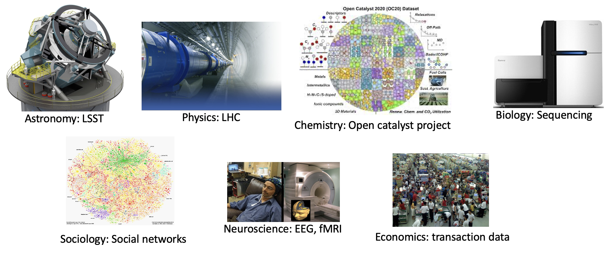
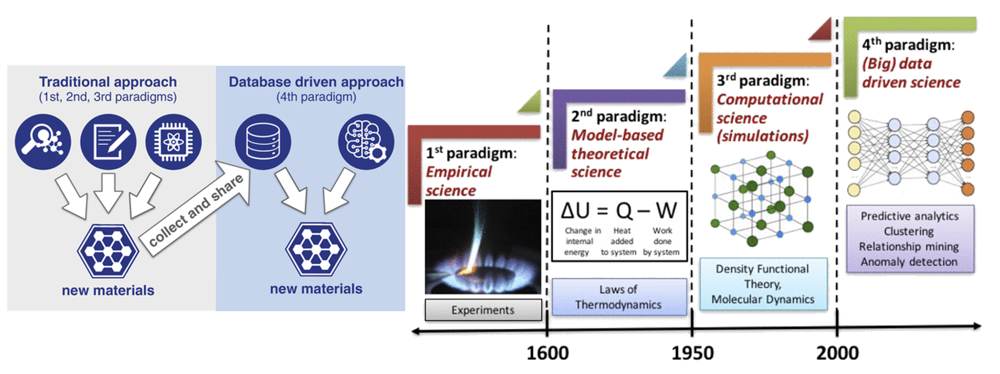

# MSE 544 Week 1
## Lecture 1: Introduction to Big Data For Materials Science

Github page Authors: Ting Cao & [Ziyu Zhang](https://github.com/Ilxxll)

## Table of Content
- [Part 1 Introduction to Big Data for Materials: History, Method, and Motivation](#part1)
  - [1.1 What is Data?](#part1_1)
  - [1.2 History and Method of Materials Big Data and Materials Discovery](#part1_2)
  - [1.3](#part1_3)
- [part 2 Course plan](#part2)
  - [2.1](#part2_1)
  - [2.2](#part2_2)
  - [2.3](#part2_3)
- [part 3 Introduction to Unix-Based Computer Systems and Hyak](#part 3)
  - [3.1](#part3_1)
  - [3.2](#part3_2)
  - [3.3](#part3_3)
  
  
  
## Tuorial Part 1 
## Introduction to Big Data for Materials: History, Method, and Motivation 
  
### 1.1 What is Data? 
  
In the pursuit of knowledge, data is a collection of discrete values that convey information, describing quantity, quality, fact, statistics, other basic units of meaning, or simply sequences of symbols that may be further interpreted. Data may represent abstract ideas or concrete measurements.  Data is commonly used in scientific research, economics, and in virtually every other form of human organizational activity.[^1]

In this era, we no longer lack data， but we can use a lot of data. Data is commonly used in scientific research, economics, and in virtually every other form of human organizational activity. 

### 1.2 History and Method of Materials Big Data and Materials Discovery 

For thousands of years, science was purely empirical, which here corresponds to metallurgical observations over the “ages” (stone, bronze, iron, steel). Then came the paradigm of theoretical models and generalizations a few centuries ago, characterized by the formulation of various “laws” in the form of mathematical equations; in materials science, the laws of thermodynamics are a good example. But for many scientific problems, the theoretical models became too complex with time, and an analytical solution was no longer feasible.

With the advent of computers a few decades ago, a third paradigm of computational science became
very popular. This has allowed simulations of complex real-world phenomena based on the theoretical models of the second paradigm, and excellent examples of this in materials science are the density functional theory (DFT) and molecular dynamics (MD) simulations. These paradigms of science have contributed in turn towards advancing the previous paradigms, and today these are popular as the branches of theory, experiment, and computation in almost all scientific domains. The amount of data being generated by these experiments and simulations has given rise to the fourth paradigm of science over the last few years, which is (big) data-driven science, and it unifies the first three paradigms of theory, experiment, and computation/simulation. It is increasingly becoming popular in the field of materials science as well and has, in fact, led to the emergence of the new field of materials informatics. 

Data science used in the fourth paradigm mainly includes the following five aspects: data management, machine learning, statistics, visualization and software engineering. Through the application of these five aspects, we can realize material discovery more efficiently.
