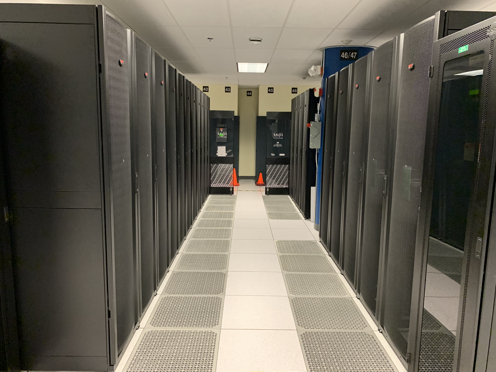
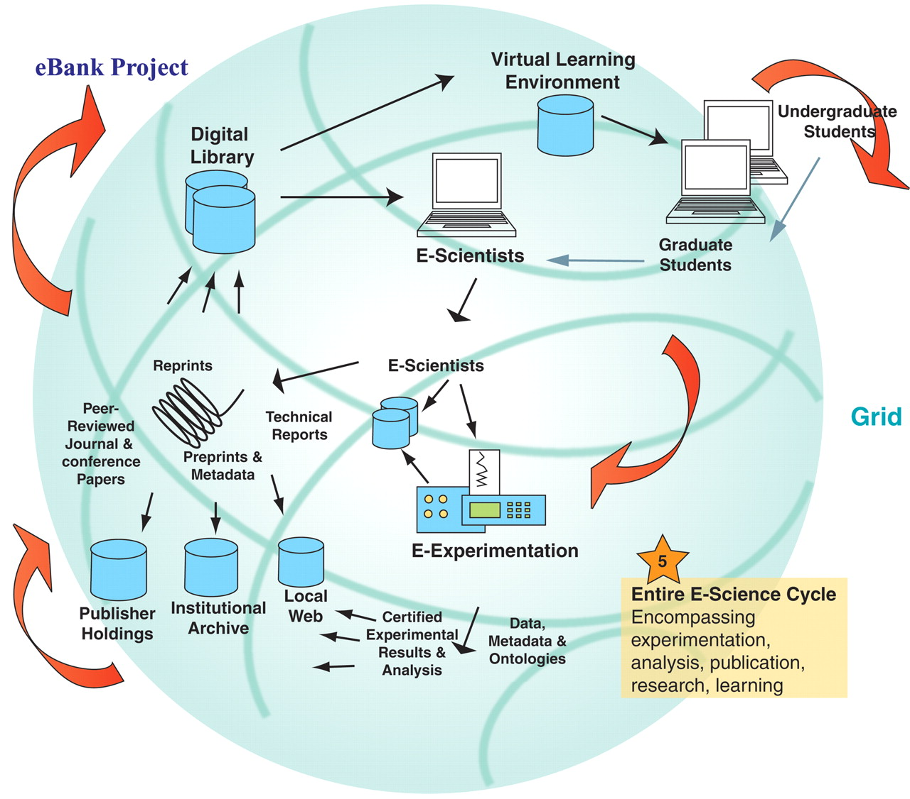

# MSE 544 Week 1
## Lecture 1: Introduction to Big Data For Materials Science

Github page Authors: Ting Cao & [Ziyu Zhang](https://github.com/Ilxxll)

## Table of Content
- [Part 1 Introduction to Big Data for Materials: History, Method, and Motivation](#part1)
  - [1.1 What is Data?](#part1_1)
  - [1.2 History and Method of Materials Big Data and Materials Discovery](#part1_2)
  - [1.3 Using HPC and Cloud for MSE research](#part1_3)
- [part 2 Introduction to Unix-Based Computer Systems and Hyak](#part2)
  - [2.1](#part2_1)
  - [2.2](#part2_2)
  - [2.3](#part2_3)
  
  
  
## Tuorial Part 1 
## Introduction to Big Data for Materials: History, Method, and Motivation 
  
### 1.1 What is Data? 
  
In the pursuit of knowledge, data is a collection of discrete values that convey information, describing quantity, quality, fact, statistics, other basic units of meaning, or simply sequences of symbols that may be further interpreted. Data may represent abstract ideas or concrete measurements.  Data is commonly used in scientific research, economics, and in virtually every other form of human organizational activity.[^1]

In this era, we no longer lack data， but we can use a lot of data. Data is commonly used in scientific research, economics, and in virtually every other form of human organizational activity. 

### 1.2 History and Method of Materials Big Data and Materials Discovery 

For thousands of years, science was purely empirical, which here corresponds to metallurgical observations over the “ages” (stone, bronze, iron, steel). Then came the paradigm of theoretical models and generalizations a few centuries ago, characterized by the formulation of various “laws” in the form of mathematical equations; in materials science, the laws of thermodynamics are a good example. But for many scientific problems, the theoretical models became too complex with time, and an analytical solution was no longer feasible.

With the advent of computers a few decades ago, a third paradigm of computational science became very popular. This has allowed simulations of complex real-world phenomena based on the theoretical models of the second paradigm, and excellent examples of this in materials science are the density functional theory (DFT) and molecular dynamics (MD) simulations. These paradigms of science have contributed in turn towards advancing the previous paradigms, and today these are popular as the branches of theory, experiment, and computation in almost all scientific domains. The amount of data being generated by these experiments and simulations has given rise to the fourth paradigm of science over the last few years, which is (big) data-driven science, and it unifies the first three paradigms of theory, experiment, and computation/simulation. It is increasingly becoming popular in the field of materials science as well and has, in fact, led to the emergence of the new field of materials informatics. 

Cyberinfrastructure and tools includes high-performance parallel computing (HPC) and cloud computation. HPC is technology that uses clusters of powerful processors, working in parallel, to process massive multi-dimensional datasets (big data) and solve complex problems at extremely high speeds. HPC systems typically perform at speeds more than one million times faster than the fastest commodity desktop, laptop or server systems.

HPC is available to universities and research institutes. In UW, we can use our own HPC, HYAK. HYAK is part of the University of Washington's cyberinfrastructure plan to support world-class research in every department. HYAK is an ecosystem of high-performance compute (HPC) clusters and supporting infrastructure.

In order to effectively utilize HPC systems, it is important to have a strong understanding of the tools and technologies involved. One such tool is the Bash shell, which provides a command-line interface for interacting with HPC systems. Additionally, the Slurm workload manager is commonly used to manage and schedule jobs on HPC systems, allowing users to efficiently utilize available computing resources.

To automate repetitive tasks and streamline workflows, scripts can be used to automate tasks such as data pre-processing, analysis, and post-processing. Version control is also critical when working with code and scripts, which is where Github comes in. Github is a web-based platform for managing and sharing code, enabling collaborative development and version control.

Parallel computing is another key component of HPC, which involves breaking down a large task into smaller subtasks that can be executed concurrently on multiple processors or cores. This approach can significantly improve processing times and enable faster analysis of large datasets.

Overall, proficiency in these tools and technologies can help researchers, scientists, and engineers leverage the full potential of HPC systems, enabling them to solve complex problems in fields such as bioinformatics, computational chemistry, and physics.

Cloud computing is the on-demand delivery of IT resources over the Internet with pay-as-you-go pricing. Instead of buying, owning, and maintaining physical data centers and servers, you can access technology services, such as computing power, storage, and databases, on an as-needed basis from a cloud provider like Azure.

Cloud computing allows developers to access powerful computing resources on-demand, without having to invest in and maintain their own hardware infrastructure. Cloud computing providers offer a range of services, including compute power, storage, and databases, that can be easily scaled up or down depending on the needs of the application.

Docker and containerization provide a way for developers to package their applications and dependencies into lightweight, portable units that can be easily deployed across different environments. Containers are isolated from the host system, which allows for greater consistency and portability, and reduces the risk of conflicts between different applications.

Serverless APIs provide a way for developers to build and deploy applications without worrying about the underlying infrastructure. Serverless platforms automatically manage scaling and availability, allowing developers to focus on building the application logic.

Virtual Machines (VMs) provide a way to emulate an entire computer system within a single, isolated environment. This approach enables developers to test and deploy their applications on different operating systems and hardware configurations, without having to set up multiple physical machines.

Overall, cloud computing, Docker and containerization, Serverless APIs, and Virtual Machines (VMs) are all key technologies that are helping to shape the future of software development. By leveraging these technologies, developers can build, test, and deploy applications faster and more efficiently, while reducing the costs and complexity associated with traditional infrastructure management.

Luckily for us. We have Azure credits for our class, which means that we can use Azure free in this course!

### 1.3 Using HPC and Cloud for MSE research 

The field of Materials Science and Engineering (MSE) requires powerful computing resources to analyze and simulate complex materials at the molecular and atomic level. High-Performance Computing (HPC) and cloud computing are two key technologies that are transforming the way MSE researchers work.

HPC systems can be used to run large-scale simulations and modeling, allowing researchers to study materials properties and behaviors. These simulations can be highly compute-intensive and require specialized HPC hardware and software to run efficiently. In addition to HPC, cloud computing provides another option for researchers to access powerful computing resources, without the need for a dedicated HPC infrastructure. Cloud-based HPC services offer scalable and flexible solutions for running simulations, and can be a cost-effective option for smaller research groups.

Another area where HPC and cloud computing are having a significant impact is in the analysis of image data using machine learning (ML). ML algorithms can be used to analyze large datasets of images, allowing researchers to identify patterns and relationships between different materials and structures. HPC and cloud-based solutions offer the necessary computing power to run ML algorithms on large datasets, enabling faster and more accurate analysis.

Quantum chemistry is another area where HPC and cloud computing are transforming the field. Quantum chemistry simulations are computationally demanding and require specialized hardware and software to run efficiently. HPC and cloud-based solutions provide the necessary computing resources to run these simulations, enabling researchers to study the behavior of complex molecules and materials at the quantum level.

In addition to these specific use cases, cloud-based methods and strategies are also being used in other areas of MSE research, such as Natural Language Processing (NLP). NLP algorithms can be used to analyze large datasets of scientific literature, allowing researchers to identify new materials and research areas. Cloud-based solutions offer the necessary computing resources to run these algorithms on large datasets, enabling faster and more accurate analysis.

Overall, HPC and cloud computing are transforming the way MSE research is conducted, enabling faster and more efficient analysis of complex materials and structures. These technologies are opening up new avenues for research and discovery, and are helping to accelerate progress in the field of Materials Science and Engineering.

The UK eBank project is focused on the changing landscape of scholarly communication, building links from e-research to e-learning, facilitating the scholarly knowledge cycle through the integration of digital repositories (experimental data, e-prints, and learning objects), and providing aggregator services.

  
## Tuorial Part 2 
## Introduction to Unix-Based Computer Systems and Command Line. 

### 2.1 Graphical User Interfaces (GUIs) and Command-Line Interfaces (CLIs) 

Graphical User Interfaces (GUIs) and Command-Line Interfaces (CLIs) are two ways of interacting with computer systems. Both have their advantages and disadvantages, and which one is better depends on the specific use case.

GUIs are often considered more user-friendly and easier to learn than CLIs. GUIs allow users to interact with the system through a visual interface, typically with buttons, menus, and icons. This makes it easy for users to perform tasks without having to remember complex commands or syntax. GUIs can also provide real-time feedback to the user, making it easier to understand what is happening as a task is being performed.

On the other hand, CLIs are often preferred by experienced users and developers who need more control over the system. CLIs allow users to interact with the system through a command prompt, typically with typed commands and parameters. This makes it easier to perform complex tasks and automate repetitive tasks using scripts. CLIs can also be faster and more efficient than GUIs, especially for tasks that require a lot of typing or navigating through multiple menus.

Overall, the choice between GUIs and CLIs depends on the user's level of experience and the specific task at hand. GUIs are generally more user-friendly and accessible, while CLIs offer more control and flexibility for power users and developers. Some tasks may be better suited to a GUI, while others may be more efficiently performed using a CLI. In some cases, a combination of both GUI and CLI interfaces may be the most effective solution, allowing users to choose the best tool for each specific task.

