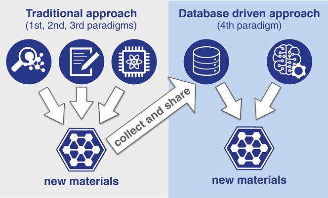

# MSE 544 Week 1
## Lecture 1: Introduction to Big Data For Materials Science

Github page Authors: Ting Cao & [Ziyu Zhang](https://github.com/Ilxxll)

## Table of Content
- [Part 1 Introduction to Big Data for Materials: History, Method, and Motivation](#part1)
  - [1.1](#part1_1)
  - [1.2](#part1_2)
  - [1.3](#part1_3)
- [part 2 Course plan](#part2)
  - [2.1](#part2_1)
  - [2.2](#part2_2)
  - [2.3](#part2_3)
- [part 3 Introduction to Unix-Based Computer Systems and Hyak](#part 3)
  - [3.1](#part3_1)
  - [3.2](#part3_2)
  - [3.3](#part3_3)
  
  
  
## Tuorial Part 1 
## Introduction to Big Data for Materials: History, Method, and Motivation 
  
### 1.1 What is Big Data? 
  
In the pursuit of knowledge, data is a collection of discrete values that convey information, describing quantity, quality, fact, statistics, other basic units of meaning, or simply sequences of symbols that may be further interpreted. Data may represent abstract ideas or concrete measurements.  Data is commonly used in scientific research, economics, and in virtually every other form of human organizational activity.[^1]

In this era, we no longer lack data， but we can use a lot of data. Data is commonly used in scientific research, economics, and in virtually every other form of human organizational activity. 

### 1.2 History and Method of Materials Big Data and Materials Discovery

The field of materials science relies on experiments and simulation-based models to understand the “physics” of different materials in order to better understand their characteristics and discover new materials with improved properties for use in society at all levels.     

Lately, the “big data” generated by such experiments and simulations has offered unprecedented opportunities for application of data-driven techniques in this field, thereby opening up new avenues for accelerated materials discovery and design.

